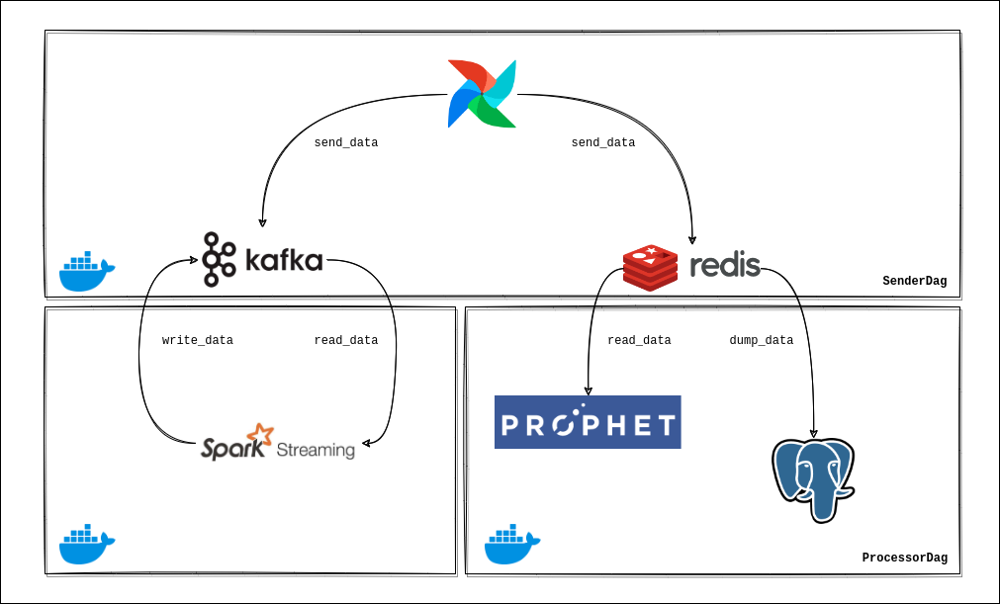
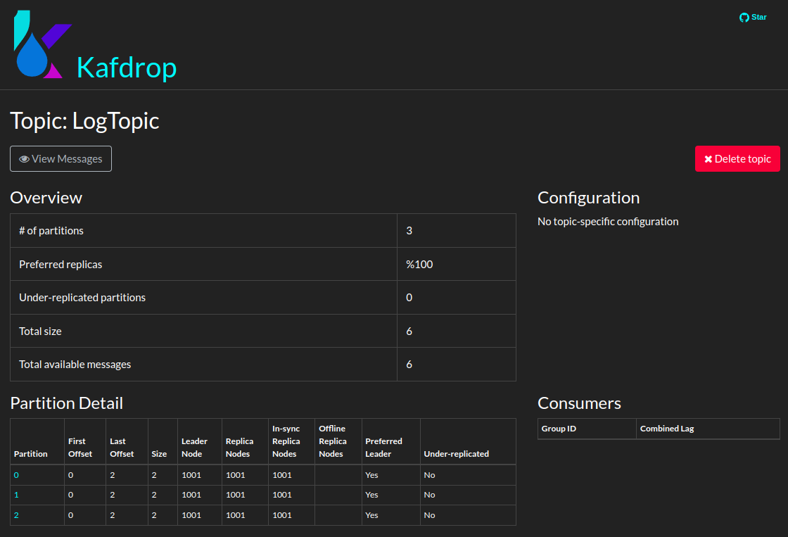
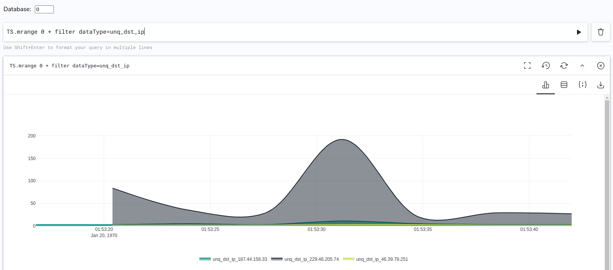
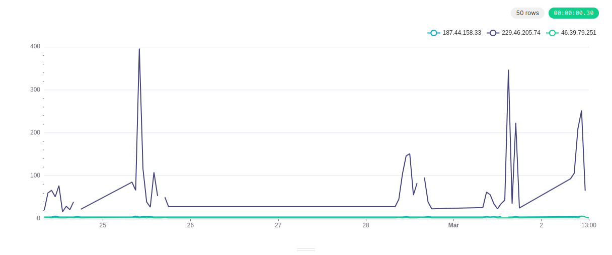

## Stream Processing with Spark-Streaming, Kafka, Redis and Airflow


### About

The main purpose of this project is creating streaming flow with analyzing randomly generated IPs matched different behaviors of real IPs. This study includes **analysis**, **forecasting** and **anomaly detection** on **time series data**.


### Workflow



- **Initialization**: Project has also **InitialDag** does not take place in workflow schema. This DAG is triggered only once from Airflow, so it creates initial conditions: <br><br>
  - **Kafka**: Topics are created according to **config.json** file.
  - **Redis Time Series Database (RTSDB)**: Fields are created using IPs and training column types (unq_dst_ip, frequency etc.) as keys in RTSDB.

  <br>
- **Data Generation**: Data is generated as anonymized data. There are generated source ips that have features merged from real data.
Each data takes place in a single JSON file. These files are sent to relevant tools via Airflow DAG.
After sending, next data file name is written to **config.json** file.

  <br>
    Example file: <br>
  &nbsp;{ <br>
  &nbsp; "src_ip": "187.44.158.33", <br>  
  &nbsp; "unq_dst_ip": "3" <br>
  &nbsp; _other features_ <br>
  &nbsp; "timestamp": "2022-01-03 09:00:00" <br>
  &nbsp;} <br>
  

- **Data Distribution and Processing**: There are two third-party tools for data distribution: **Kafka** and **Redis**. <br><br>
  - **Kafka**: Each data has **different partitions** according to their IP in one Kafka topic. There is ip-partition map was done before running application.
  Kafka data is used by **Spark Streaming**. Spark master and worker containers always listen the **LogTopic** and collect data with complete mode so
  data is never lost. Then, Spark uses another Kafka topic called **SparkStreamingTopic** to write **average** of _unq_dst_ip_ feature 
  for collected data of each ip, and also they are in different partitions in the topic. <br> <br>
  
  Example: Kafka partitions after the first two data of each IP is sent: <br> <br>

   <br> <br>

  - **Redis Time Series Database (RTSDB)**: Each IP based data is sent to related key of database, they are separated. The data is used for time series forecasting 
  with **Facebook Prophet** model. Thanks to Prophet's work with **Spark** parallelization and grouping, each data has its own forecasting model.
  After training operation finished, RTSDB is cleaned to prevent overloading of cache mechanism. Training is scheduled with **Airflow**
  and historical data (which is cleaned from RTSDB) is dumped to **PostgreSQL Database** for consistency of data. <br> <br>

  Example: RTSDB before periodic cleaning of the data: <br> <br>

   <br> <br>


- **Data Visualization**: Currently, **Apache Superset** service that has PostgreSQL package installed via Dockerfile has been added to Docker environment. 
It will be improved adding forecasting visualization with comparing real data and forecasted data. <br>
<br>
Example: Visualization of Real Data from PostgreSQL (dumped RTSDB):
<br>



  **Note**: It seems graphic has some gaps between data. This is because Airflow duplicates or deletes some messages out of its scheduling mechanism (problem).


### Configuration Notes

Bitnami's Docker distributions are used for Kafka and Spark containers. In previous attempts with other publishers like official and Confluent, Spark Streaming-Kafka connection **did not work**.

**example_files** folder can be used to understand data format and if desired, the number of data can be increased, because it must be sufficient to run Prophet model properly.
Please change the folder name to **cl_logs**.

In **.env** file, Airflow, Spark, Kafka, Kafka Visualizer and Postgres containers have some important configurations. *SELECTED_DATA* contained list of original data part before the anonymized data was constructed.
So, it does not need to be visible.

#### Docker Services and Port Mappings:

- Airflow &rarr; **8080**
- Kafka &rarr; **9092**
- Spark
  - Master &rarr; **7077**
  - Internal &rarr; **8080**
  - External &rarr; **9090**
- Kafdrop (Kafka Visualizer) &rarr; **9000**
- Redis &rarr; **6379**
- Redis Insight &rarr; **8001**
- Superset &rarr; **8088**
- Zookeeper &rarr; **2181**
- Postgres
  - Internal &rarr; **5432**
  - External &rarr; **5434**

### Run

For the system to work:

```angular2html
docker-compose up -d --build
```

Build operation is required in first run. 
